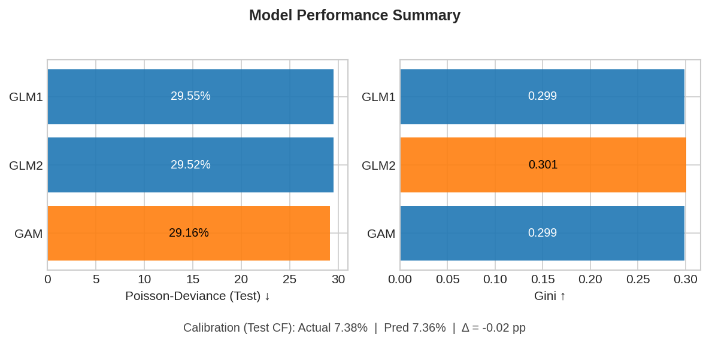

# freMTPL2 — Pricing (Frequency)
GLM/GAM mit OOF-Validierung, Kalibrierung und schlanker Governance

Ein kleines, reproduzierbares Pricing-Setup auf dem freMTPL2-Datensatz. 
Fokus: saubere Frequenz-Baselines (GLM/GAM), OOF-Vergleich, Kalibrierung und möglichst wenig "Magie".

---

## TL;DR – Ergebnisse (aktueller Lauf)
| Modell | Test-PDW ↓ | Gini ↑ | Kalibrierung (Act/Pred CF) |
|:--|--:|--:|--:|
| INT (Intercept) | 31.26 % | –    | – |
| GLM1            | 29.55 % | 0.299 | 7.38 % / 7.36 % |
| GLM2            | 29.52 % | 0.301 | 7.38 % / 7.36 % |
| **GAM**         | **29.16 %** | **0.299** | **7.38 % / 7.36 %** |


- **Interpretierbarkeit:** Splines (z. B. Driver Age) mit Konfidenzbändern statt Black-Box.

> Hinweis: Zahlen stammen aus dem letzten Run. Seeds/Folds konstant (5-Fold OOF, Seed 42), Test nur 1×.

- **Performance Summary (PDW/Gini + Calibration)**  
  


## Explorative Analyse (EDA)
Zur Orientierung: ein paar klassische Muster aus dem freMTPL2-Datensatz.

| Fahrer-/Fahrzeugvariablen | Beispielplots |
|:--|:--|
| Bonus-Malus & Fahrer-Alter |  |
| Fahrzeugalter & Bonus-Malus |  |
| Brand & Fuel |  |


---

## Modellplots (GLM/GAM)
| Thema | Plot |
|:--|:--|
| **Kalibrierung (Deciles)** |  |
| **Partial Effect – Driver Age** |  |
| **Partial Effect – VehAge** |  |
| **Lorenz-/Gini-Vergleich (GLM1/2 vs GAM)** |  |

> Diese vier Grafiken stammen aus dem Notebook `03_glm_gam_boosting.ipynb`.  


---

## Quickstart
```bash
python -m venv .venv && source .venv/bin/activate   # Win: .venv\Scripts\activate
pip install -r requirements.txt
jupyter lab

```
