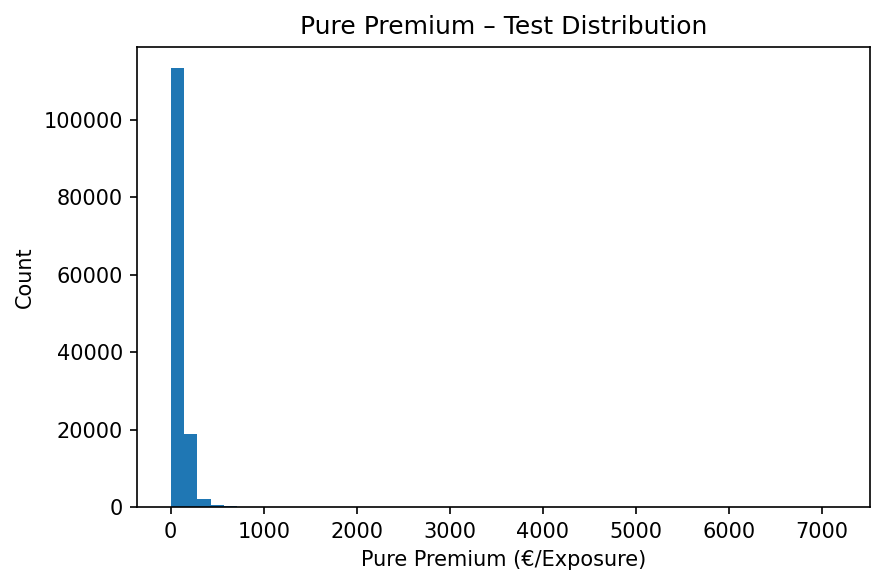

# freMTPL2 — Pricing (Frequency & Severity)
GLM/GAM mit OOF-Validierung, Kalibrierung und schlanker Governance

Ein kleines, reproduzierbares Pricing-Setup auf dem freMTPL2-Datensatz.
Fokus: saubere Frequenz-Baselines (GLM/GAM), OOF-Vergleich, Kalibrierung – plus Severity und Pure Premium.

---

**Business-Nutzen:** Validierte Basismodelle (GLM/GAM) plus Severity liefern einen plausiblen Pure-Premium-Floor für Tarif-Szenarien und Governance-Prüfungen.

> **EN (short):** Reproducible actuarial pricing on freMTPL2. GLM/GAM with 5-fold OOF validation, calibration plots, Lorenz/Gini, and severity → pure premium. Figures and notebooks included.


### Modell-Überblick (Test)


- PDW ↓: Poisson-Deviance (gewichtete PDW)  
- Gini ↑: Discriminative Power (Lorenz-basiert)  
- Calibration: Actual vs. Predicted Claim Frequency (gesamt)  
- Pure Premium: erwartete €/Exposure (E[N] × E[X]) aus GLM/GAM + Severity

---

## TL;DR – Ergebnisse (aktueller Lauf)
| Modell | Test-PDW ↓ | Gini ↑ | Kalibrierung (Act/Pred CF) |
|:--|--:|--:|--:|
| INT (Intercept) | 31.26 % | –    | – |
| GLM1            | 29.55 % | 0.299 | 7.38 % / 7.36 % |
| GLM2            | 29.52 % | 0.301 | 7.38 % / 7.36 % |
| **GAM**         | **29.16 %** | **0.299** | **7.38 % / 7.36 %** |

- Validierung: **5-Fold OOF (Seed 42), Fold 5 = Test (~20 %)**  
- **Severity/PP (Test): E[X] ≈ 2 237 € · E[N] ≈ 0.0389 · PP ≈ 87.3 €/Exposure** 
- Interpretierbarkeit: Splines (z. B. Driver Age) mit Konfidenzbändern; Decile-Kalibrierung; Lorenz/Gini

---

## Explorative Analyse (EDA)
Zur Orientierung: klassische Muster im freMTPL2-Datensatz (höhere Frequenz bei jungen Fahrern/alten Fahrzeugen; BM verschiebt das Niveau erwartungsgemäß).

| Fahrer-/Fahrzeugvariablen | Beispielplots |
|:--|:--|
| Bonus-Malus & Fahrer-Alter |  |
| Fahrzeugalter & Bonus-Malus |  |
| Brand & Fuel |  |

> Diese Grafiken stammen aus `02_eda_overview.ipynb`.

---

## Modellplots (GLM/GAM)
| Thema | Plot |
|:--|:--|
| **Kalibrierung (Deciles)** |  |
| **Partial Effect – Driver Age** |  |
| **Partial Effect – VehAge** |  |
| **Lorenz-/Gini-Vergleich (GLM1/2 vs GAM)** |  |

> Diese vier Grafiken stammen aus `03_glm_gam_boosting.ipynb`.

---

## Severity & Pure Premium
**Verteilung und Profil nach DrivAge**

- Lineare Skala: zeigt die Hauptmasse (bulk of exposure)  
  

- Logarithmische Skala: offenbart Heavy Tails  
  

- Nach Fahrer-Alter (binned): zeigt leicht ansteigendes Risikoprofil  
  

> Diese Grafiken stammen aus `04_severity_pure_premium.ipynb`.


---

## Quickstart
```bash
python -m venv .venv && source .venv/bin/activate   # Win: .venv\Scripts\activate
pip install -r requirements.txt
jupyter lab  # für Notebooks
